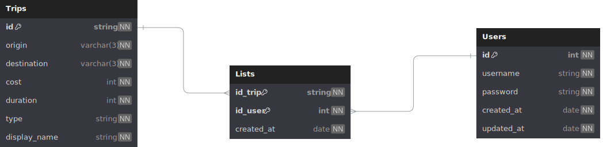

# Technical Assesment BizAway

## Introduction

This is my implementation (@JuanjoLopez19) of the [technical assesment](https://bitbucket.org/bizaway/tech-challenge/src/main/backend.md).
It's an API RESTFull that allows to search for flights between two given cities, ordered by price or duration and also allow the user post registration to create a trips saved list.

# Technologies

- Core system:
  - Programming Language: [TypeScript](https://www.typescriptlang.org/) (v5.1.3)
  - JavaScript Runtime Environment: [Node.js](https://nodejs.org/en) (v21.7.3)
  - API RESTfull Framework: [NestJS](https://docs.nestjs.com/) (v10.4.8)

- Database:
  - Database Management System: [PostgreSQL](https://www.postgresql.org/) (v17.0)
  - Object Relation Mapping: [Prisma](https://www.prisma.io/) (v5.22.0)

- Cache:
  - Cache Management System: [Redis](https://redis.io/) (v7.4.1)
  
- Testing tools:
  - Testing Framework: [Jest](https://jestjs.io/) (v29.5.0)

- Documentation:
  - Documentation Framework: [Swagger](https://swagger.io/)

- Deployment:
  - Containerization: [Docker](https://www.docker.com/)
  - Orchestration: [Docker Compose](https://docs.docker.com/compose/)

# Features

## Endpoints

The project has an inbuilt Swagger documentation that can be accessed in the `/docs` route that show more information about the funcionality.

- Basic user authentication based on JWT and Cookies
  - User registration and login
    - POST `auth/register`: Regsiter a new user with basic information
    - POST `auth/login`: Login with the user credentials creating a JWT token stored in a cookie that will be send to the client and needed for the following requests

- Search for trips between two given airports
  - GET `/trips`: Search for trips between two given airports that can be sorted by price or duration
    - Query parameters:
    - `origin`: The origin airport IATA code
    - `destination`: The destination airport IATA code
    - `sort`: The sorting criteria (price or duration)
    - `order`: The sorting order (asc or desc)

  - Get `/trips/:id`: Get the trip with the given id

- Management of the saved trips list
  - POST `/trips`: Save a trip in the user's saved trips list
  - GET `/trips/saved`: Get the user's saved trips list
  - DELETE `/trips/:id`: Delete the trip with the given id from the user's saved trips list

## Data model



### Entities

- User: Represents a basic user of the application, only has username and password for simplicity

- Trip: Represents a trip fetched from the 3rd Party API

- Lists: Represents the saved trips list of the user (the set of this entities represent the list of the user, each entity is a trip saved by the user)

### Relations

- Trips -> Lists: One to Many relation between the trips and the lists,that's it becasue one trip could be in many saved lists
- User -> Lists: One to Many relation between the user and the lists, each user could have more than one saved trip
- User -> Trips: Many to Many relation between the user and the trips, each user could have more than one trip and each trip could be in more than one user list

## Additions

- Cache System
  - It's implemented a cache system with redis to store the search results of the following requests, TTL times can be configured in the .env file:
    - GET `/trips`
    - GET `/trips/:id`
- Redis data manager with redis-commander
  - It's implemented a redis-commander to manage the cache data in the redis server, it can be accessed in the port 8081 of the server (if using docker)

- Export of the saved trips list
  - GET `/trips/lists/export`: Export the user's saved trips list in a CSV file or JSON format

- HTTPS support

- Dockerized application

- Code Quality Assurance configured in the project with [SonarQube](https://www.sonarsource.com/products/sonarqube/) in the `assesments/sonar-project.properties` file
  - Modify the file with the sonarqube server url and token (can be deployed with docker, the docker compose file is in `assets/docker-compose.yml`)

- Run the SonarQube scanner with the following [command](https://docs.sonarsource.com/sonarqube-server/latest/analyzing-source-code/scanners/sonarscanner/)

```bash
cd assesment
docker run --rm --network=sonarnet -v "$(pwd):/usr/src" sonarsource/sonar-scanner-cli
```

# Installation guide

## Without Docker

### Databases

#### PostgreSQL

- Install PostgreSQL

```bash
sudo apt update && sudo apt upgrade
sudo apt install postgresql postgresql-contrib
```

- Create the database

```bash
sudo -u postgres psql
CREATE DATABASE <DATABASE_NAME>;
```

- Create the user

```bash
CREATE USER <USER_NAME> WITH ENCRYPTED PASSWORD '<PASSWORD>';
ALTER ROLE <USER_NAME> SET client_encoding TO 'utf8';
ALTER ROLE <USER_NAME> SET default_transaction_isolation TO 'read committed';
ALTER ROLE <USER_NAME> SET timezone TO 'UTC';
GRANT ALL PRIVILEGES ON DATABASE <DATABASE_NAME> TO <USER_NAME>;
```

#### Redis

- Install Redis

```bash
sudo apt-get install lsb-release curl gpg
curl -fsSL https://packages.redis.io/gpg | sudo gpg --dearmor -o /usr/share/keyrings/redis-archive-keyring.gpg
sudo chmod 644 /usr/share/keyrings/redis-archive-keyring.gpg
echo "deb [signed-by=/usr/share/keyrings/redis-archive-keyring.gpg] https://packages.redis.io/deb $(lsb_release -cs) main" | sudo tee /etc/apt/sources.list.d/redis.list
sudo apt-get update
sudo apt-get install redis
```

- Configure on startup

```bash
sudo systemctl enable redis-server
sudo systemctl start redis-server
```

- Configure Auth (Optional)

```bash
sudo nano /etc/redis/redis.conf

# Modify the line
requirepass <PASSWORD>

# Restart the service
sudo systemctl restart redis 
```

### Core System

1. Clone the repository

```bash
git clone https://github.com/JuanjoLopez19/TechAssesment-BizAway
```

2. Install Node.js

```bash
# installs nvm (Node Version Manager)
curl -o- https://raw.githubusercontent.com/nvm-sh/nvm/v0.40.0/install.sh | bash
# download and install Node.js (you may need to restart the terminal)
nvm install 21
# verifies the right Node.js version is in the environment
node -v # should print `v21.7.3`
# verifies the right npm version is in the environment
npm -v # should print `10.5.0`
```

3. Install yarn (optional)

```bash
npm install -g yarn
``` 

4. Install Node.js dependencies

```bash
cd TechAssesment-BizAway
yarn # or npm install
```

5. Modify the environment variables in the `docker/app.env` file and copy it to the root of the project
5.1 Move the self-signed certificate from `docker/ssl` to `assesment/src/certs` (If you have enable HTTPS in the .env file)

6. Generate the Prisma client and make the migrations

```bash
yarn prisma:generate

# Create the migrations
yarn migrate:deploy
```

7. Run the application

```bash
# Development
yarn start:dev # or npm run start:dev

# Production
yarn build # or npm run build
yarn start:prod # or npm run start:prod
```

## With Docker

- Install Docker

```bash
# Add Docker's official GPG key:
sudo apt-get update
sudo apt-get install ca-certificates curl
sudo install -m 0755 -d /etc/apt/keyrings
sudo curl -fsSL https://download.docker.com/linux/ubuntu/gpg -o /etc/apt/keyrings/docker.asc
sudo chmod a+r /etc/apt/keyrings/docker.asc

# Add the repository to Apt sources:
echo \
  "deb [arch=$(dpkg --print-architecture) signed-by=/etc/apt/keyrings/docker.asc] https://download.docker.com/linux/ubuntu \
  $(. /etc/os-release && echo "$VERSION_CODENAME") stable" | \
  sudo tee /etc/apt/sources.list.d/docker.list > /dev/null
sudo apt-get update

# Install Docker
sudo apt-get install docker-ce docker-ce-cli containerd.io docker-buildx-plugin docker-compose-plugin
```

- Modify the docker.env file with the environment variables

- Run the application

```bash
docker compose up -d # May need sudo if you are not in the docker group
```

## Testing

- Run all tests

```bash
yarn test # or npm run test
```

- Run them in watch mode

```bash
yarn test:watch # or npm run test:watch
```

- Run the coverage

```bash
yarn test:cov # or npm run test:cov
```

## Important notes

The .env files has values to simplify the use and visualisation of the project, in a real environment they would not be exposed. Likewise, the certificate files are self-signed and therefore do not represent a security breach.

### Developed by

|  |
|:--:|
| [**Juanjo López**](https://github.com/JuanjoLopez19) |
